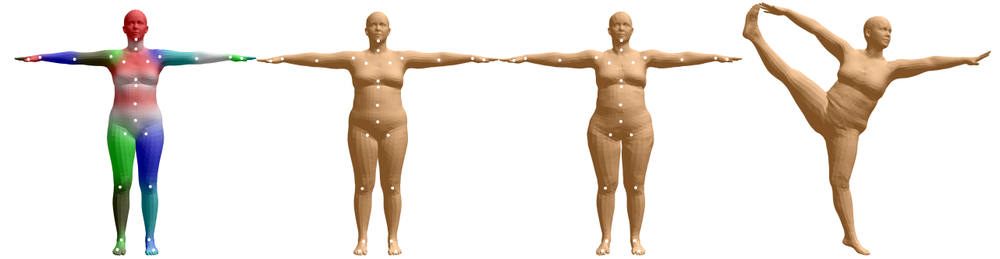
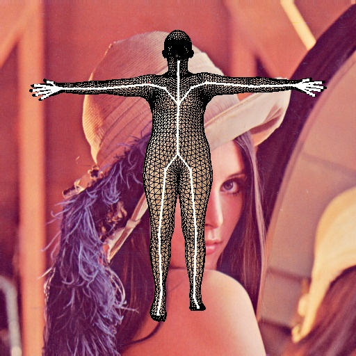
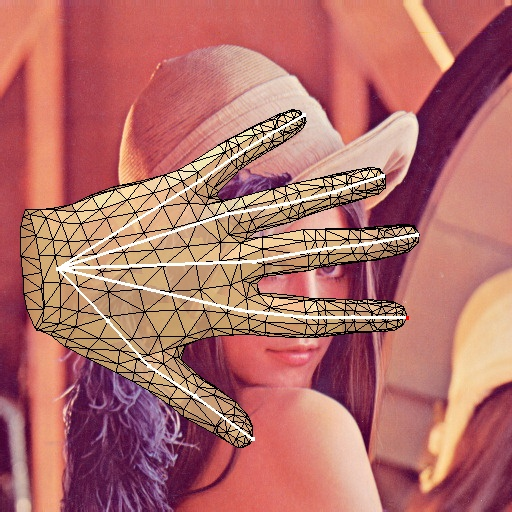
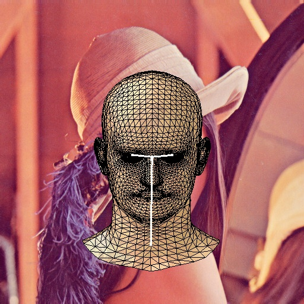

A C++ Implementation of SMPL - A Skinned Multi-Person Linear Model.

## Overview

Project based on https://github.com/YeeCY/SMPLpp repository.

This project implements a 3D human skinning model - SMPL: A Skinned
Multi-Person Linear Model with C++. The official SMPL model is available at http://smpl.is.tue.mpg.de.

It allows to set shape and pose for SMPL models like whowle body model, hand model (MANO hand), head model (FLAME model).
Such models are usually named morphable models and used in 3d fitting applications, like head or hand pose and shape estimation.

Project adopted to use with OpenCV library and includes renderer to cv::Mat images,3d to image point projection, saving 3d obj files.

## Prerequisites

- OS
  Windows 10
  MSVS 2019 (C17 support)

- Packages

1. [libTorch](https://pytorch.org/get-started/locally/): Pytorch C++ API.    
2. [CMake](https://cmake.org/download/): A tool to build, test and pack up 
   C++ program.
5. Opencv 4.x

## Model preprocessing ##

You need to preprocess initial pkl model format to npz using script  SMPL++/scripts/preprocess.py and copy result npz file to exe's folder.

